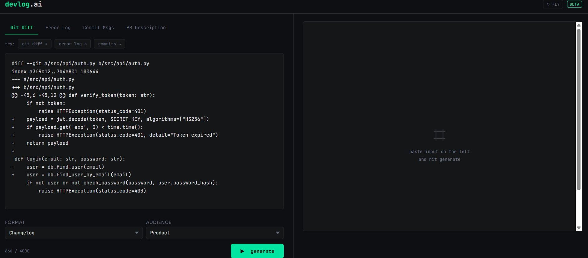
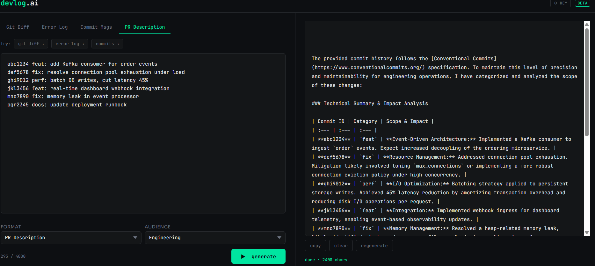

# devlog.ai

> Paste git diffs, error logs, or commit history → get changelogs, 
> PR descriptions, postmortems, and standup updates instantly.

## Why
Writing dev docs is the worst part of shipping. devlog.ai removes it.
Paste your diff. Get your changelog. 30 seconds not 30 minutes.

## Screenshots

## How to run
1. Clone the repo
2. Open index.html via live server or python -m http.server 8080
3. Go to http://localhost:8080
4. Click ⚙ KEY → paste free Gemini API key from aistudio.google.com
5. Paste input → pick format → hit generate

## Supported inputs
| Input | Example |
|---|---|
| Git Diff | paste output of git diff |
| Error Log | paste stack trace or crash log |
| Commit Messages | paste git log output |
| PR Description | paste existing PR text to improve |

## Supported output formats
| Format | Best for |
|---|---|
| Changelog | Keep a Changelog entries |
| PR Description | GitHub PR body |
| Release Notes | User-facing announcements |
| Standup Update | Daily standup bullets |
| Postmortem | Incident analysis |

## Stack
- Vanilla HTML/CSS/JS — zero dependencies, zero build step
- Google Gemini API with real-time streaming
- API key stored in localStorage 
